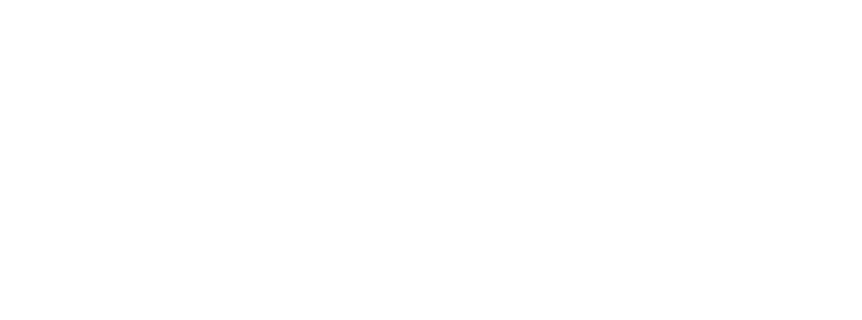

<style>
.myred {
  color: #cc0033;
}
</style>

```{r setup, include=FALSE}
 options(htmltools.dir.version = FALSE)
```


# O Status dos dados na área

1. Poucos os repositórios dedicados aos dados linguísticos
    - Mais raros ainda em língua portuguesa ou gerenciados por universidades Brasileiras
2. Necessidade de crescimento na perspectiva de ciência aberta
    - **Posse** dos dados de pesquisa
    - Sentimento de **não reprodutibilidade**
3. Status dos processos de análise quantitativa ou métodos mistos (quali/quanti)
    - Não totalmente **reconhecida** por todas as subáreas da Linguística e Linguística Aplicada
4. Não familiarização com ferramentas de análise de dados
    - Tanto de caráter qualitativo quanto quantitativo
        - Padrões de formatos **universais** e **abertos**
            - *Revistas acadêmicas*:  Solicitam envio de arquivos de texto em extensões geradas por processadores comerciais
???
- Agradecer Abralin e aos colegas de simpósio
    - Raquel e Marcos
       - Elisa, Valéria, Raimundo, Iandra, Marta e Aluiza
       
---
class: animated, fadeIn

# Dados linguísticos e ciência aberta

## Autoria
* Sistemas de licenciamento:
    * Uso de dados com reconhecimento de **autoria**
       * Pesquisa *comercial* vs. *não-comercial*
           * REA (Recursos Educacionais Abertos)

## Sigilo
* Sistemas de anonimização de dados:
  * **Ética** geral das pesquisa em ciências humanas
  * Reflexões específicas sobre **mídias sociais**
* Comitês de ética locais:
  * Necessidade de **abertura** dos dados linguísticos
  * Definição de normas **locais** de anonimização e distribuição de dados

---
class: animated, fadeIn

# Dados linguísticos e ciência aberta

## Transparência
* Abrir a **Caixa de Pandora** da coleta e análise de dados
    * **Compartilhar** programas e métodos de pesquisa
        * Elaboração de **tutoriais**
          * Divulgação em plataformas de compartilhamento 

## Ferramentas e formatos
* Ferramentas de **código aberto**
    * Formatos **universais**, **abertos** e **multiplataforma**
    * Sistemas de metadados **específicos** e **compartilhados** pela comunidade

---
class: animated, fadeIn

# Dados linguísticos e ciência aberta

## Planejamento
* Planejamento do **experimento** em todas as suas fazes
    * Consciência das *limitações*
        * Representatividade (ou não) de **grupos sociais** específicos

## Plataformas
* Plataformas institucionais abertas:
    * **Universidades**, **agências de fomento** e **Associações** de área
      * Dados disponíveis sob cadastro e submissão de **planejamento de pesquisa**

---
class: middle, animated, fadeIn

# Como operar a transformação?

### *Formação* de professores e pesquisadores
   - Metodologias mistas
   - Metodologias experimentais
   
### *Valorização* de ferramentas abertas
   - Em todos os níveis da formação, coleta e divulgação

---
class: middle, animated, fadeIn

# Como operar a transformação?


### Criação de *grupos de trabalho* específicos
   - Foco na discussão metodológica

### Valorização de estudos metodológicos
  - Publicação de discussões sobre *metodologia*
  - Publicação de discussões sobre *resultados parciais*
  - Publicação de **replicação**/**comparação** de/entre estudos

---

class: inverse, animated, fadeIn, middle

## Financiamento
```{r fig09 ,echo=FALSE,fig.align='center',out.width = "200px"}

```

## Obrigado! 

Rodrigo Esteves de Lima-Lopes


rll307@unicamp.br


[http://www.iel.unicamp.br/rll307](http://www.iel.unicamp.br/rll307)

[https://github.com/rll307/keynote_2020_2](https://github.com/rll307/keynote_2020_2)


```{r fig10 ,echo=FALSE,fig.align='center', out.width = "200px"}

```


